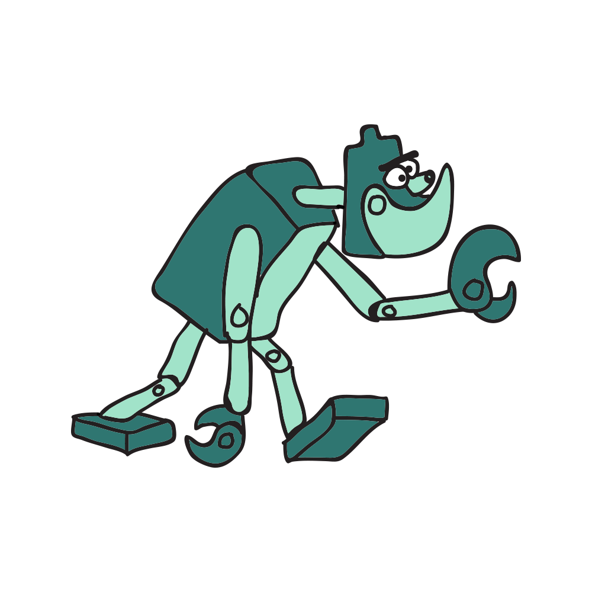

  <h1 align="center">Olá, eu sou o Savio 👋</h1>

 
    

  

  🎓 Estudante no IFES &nbsp;|&nbsp;
  💻 Java, JavaFX, Node.js e Python &nbsp;|&nbsp;
  🤖 Explorando Machine Learning e Visão Computacional

  

---

### 🛠️ Tecnologias e ferramentas

  

  
  
  
  
  
  
  

---

### 📊 Estatísticas do GitHub

  

  

---
